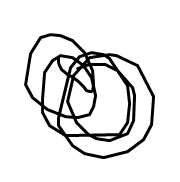
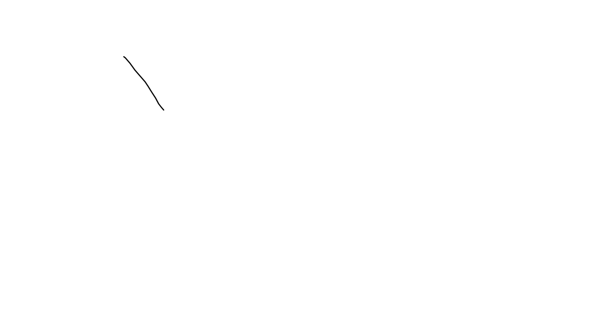

# tw~

** helow**, this is my first jekyll blog post.

I hope

```python
# This program prints Hello, world!
aa
print('Hello, world!')
```





## 머릿말

dd안녕하세요 반갑습니다.asfsafs

$Large MSE = \frac{1}{n}$ 

$a^2 + b^2 = c^2$

$$ a^2 + b^2 = c^2 $$
$$
\begin{aligned} 
a^2 + b^2 &= c^2 \\ 
E &= M \cdot C^2 \\ 
&= xy + \mathbb{E} 
\end{aligned}
$$


## 목차

- 목차1d
- 목차2
- 
- 
- 10


lk

